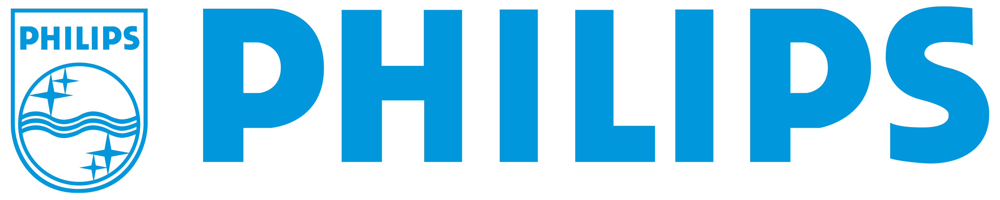
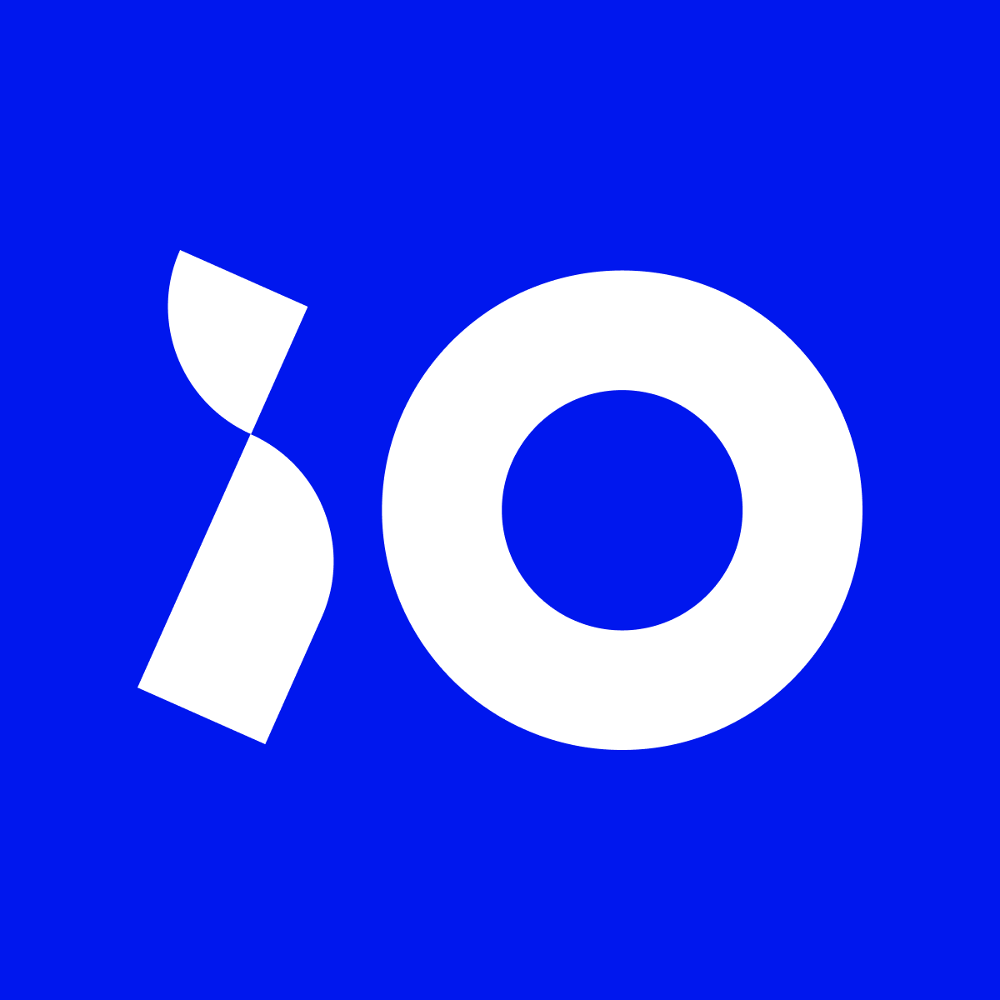

<h1 align="center">Hi there!</h1>
<h1 align="center">
My name is Kaloyan Rakov and I am a Full-Stack Software Engineering & Machine Learning student at Fontys ICT in Eindhoven, the Netherlands 💻</h1>

<h2 align="center"> My Expirience:</h2>
<h2 align="center">Companies I have worked for:</h2>

<table align="center">
<tr>
  <td></td>
  <td style="vertical-align: middle;"><h3>Internship</h3></td>
</tr>
</table>

<table align="center">
<tr>
  <td></td>
  <td style="vertical-align: middle;"><h3>University Project - <a href="https://github.com/kaloyanrakov/Logicall-AI-Product-Tracking">Repository Link</a></h3></td>
</tr>
</table>

<table align="center">
<tr>
  <td></td>
  <td style="vertical-align: middle;"><h3>University Project - <a href="https://github.com/kaloyanrakov/iO-Room-Detection">Repository Link</a></h3></td>
</tr>
</table>

<h2 align="center">Personal / University Projects:</h2>

<h2 align="center">Technologies I have worked with:</h2>

  
  
  
  
  
  
  
  
  
  
  
  
  
  
  
  
  

